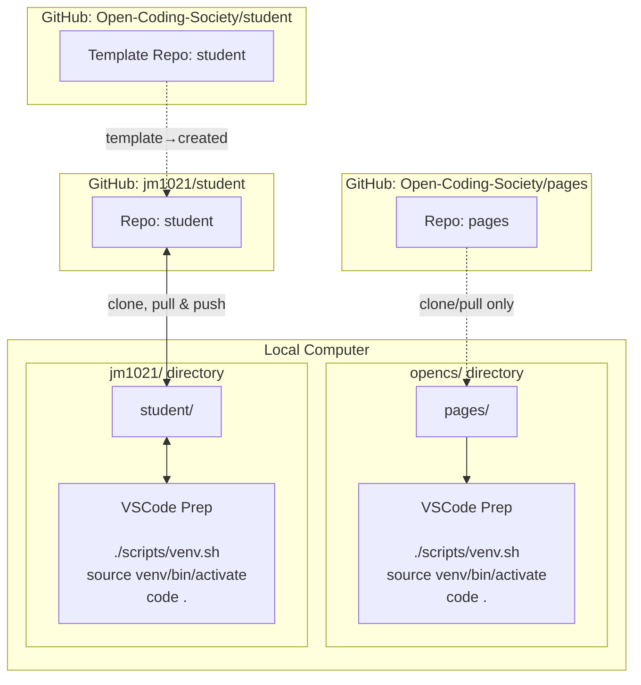

## Visual Journey

I installed WSL and ran a linux environment on my windows machine to see live updates instantly as I save them.

| Command | What it does |
|---------|---------------|
| `cd opencs/student` | Moves into the `opencs/student` directory |
| `source venv/bin/activate` | Activates the Python virtual environment named `venv` |
| `code .` | Opens the current directory in VS Code |

