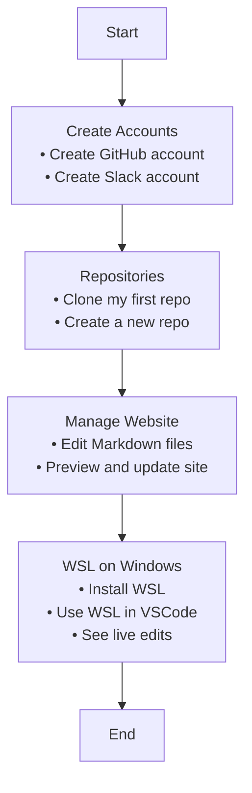

## Visual Journey

I installed WSL and ran a linux environment on my windows machine to see live updates instantly as I save them.

| Command | What it does |
|---------|---------------|
| `cd opencs/student` | Moves into the `opencs/student` directory |
| `source venv/bin/activate` | Activates the Python virtual environment named `venv` |
| `code .` | Opens the current directory in VS Code |

  
📘 <strong>GitHub Pages</strong>

- 👤 I created my GitHub account.
- 📁 I made my first repository.
- 💻 I used the VSDev.net online VSCode editor to make changes to my GitHub Pages site.
- 🌐 This allowed me to update and publish my website directly through GitHub Pages.

---

  
🖥️ <strong>Operating System (OS)</strong>

- ⚙️ I installed WSL (Windows Subsystem for Linux) on my Windows computer.
- 🐧 This let me use Linux tools inside Windows.
- 🚀 I can now open my website on `localhost` to instantly preview changes before committing them to GitHub.

---

  
📝 <strong>VSCode</strong>

- ✏️ I wrote code to update my About Me page.
- 🧩 I used Visual Studio Code to edit, preview, and manage all my project files.
- ✍️ I'm using VSCode right now to write this blog.

